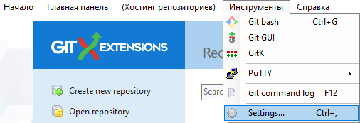
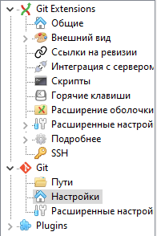
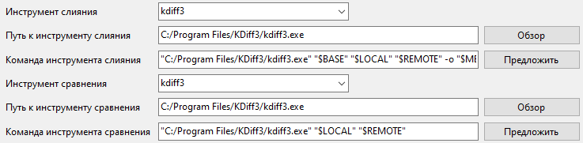

## Для чего

Когда мы хотим изменить или добавить какой-то функционал мы не можем это делать в основном коде, логично? Иначе твое приложение просто сломается пока ты не допишешь или не вернешь все назад. Что бы этого не происходило выделяют отдельные ветки:

-  **MASTER** - Мы считаем ветку origin/master главной. Т.е. исходный код в ней должен находиться в состоянии production-ready в любой произвольный момент времени.

-  **DEVELOP** - Ветвь origin/develop мы считаем главной ветвью для разработки. Хранящийся в ней код в любой момент времени должен содержать самые последние изменения, необходимые для следующего релиза.

-  **FEATURE/HOTFIX** - Вспомогательные ветви, в рамках которых выполняется разработка новой функциональности или исправление дефектов.

И представим ситуацию - ты написал новую фичу (так называют какой-то новый функционал) в ветке DEVELOP. Убедился, что она работает как задумано и не ломает остальной код, а потом еще и убедил в этом меня. Теперь нужно добавить этот новый код в основной код приложения. Выкатить патч по простому. Просто удалять весь основной код и добавлять новый нелогично и проблематично для больших проектов.

Для этого используются системы слияния и проверки конфликтов. Эта система сравнивает старый код и новый - те части, что не изменились она оставляет нетронутой, те, что поменялись - меняет.

В нашем случае это система **KDiff3**

## Установка

Скачать его можно из официального сайта:

:::tip 

<https://sourceforge.net/projects/kdiff3/files/>

:::

1. Для установки тыкнуть по зеленой кнопке, через 3 секунды файл скачается автоматически

   {width=340px height=47px}

2. Открыть загрузившийся исполняемый файл

3. Пройти по этапам мастера установки

## Настройка

На этом шаге возвращаемся к настройке [Git Extensions](./git-extensions). Попасть в меню настройки можно как показано на скриншоте

{width=506px height=173px}

Далее следуем по пути Git -> Settings

{width=196px height=294px}

И заполняем оставшиеся поля, если во время установки KDiff3 не меняли рабочих папок, то пути будут выглядеть так-же, как на скриншоте

{width=737px height=181px}

Для завершения установки жмем *Применить.*