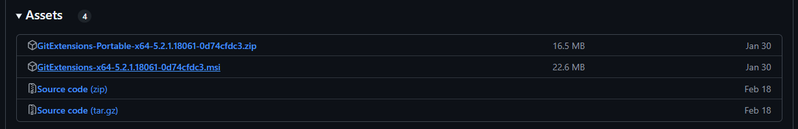

Так как работа над проектом ведется в команде, необходим общий доступ к репозиторию, а так же осуществление контроля версий.

Безоговорочным лидером для решения этой задачи является Git. Мы же используем приложение от разработчиков Git, в котором собран весь её функционал, обернутый в пользовательский UI, чтобы визуализировать процесс и упростить понимание происходящего.

Скачать его можно из официального репозитория:

:::tip 

<https://github.com/gitextensions/gitextensions/releases/tag/v5.2.1>

:::

1. Для установки внизу страницы выбрать файл [GitExtensions-x64-5.2.1.18061-0d74cfdc3.msi](https://github.com/gitextensions/gitextensions/releases/download/v5.2.1/GitExtensions-x64-5.2.1.18061-0d74cfdc3.msi)

   {width=1231px height=200px}

2. Открыть загрузившийся исполняемый файл

3. Пройти по этапам мастера установки 

