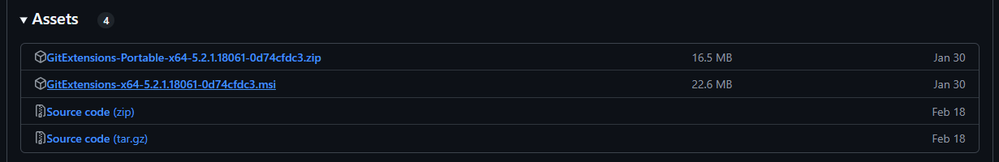
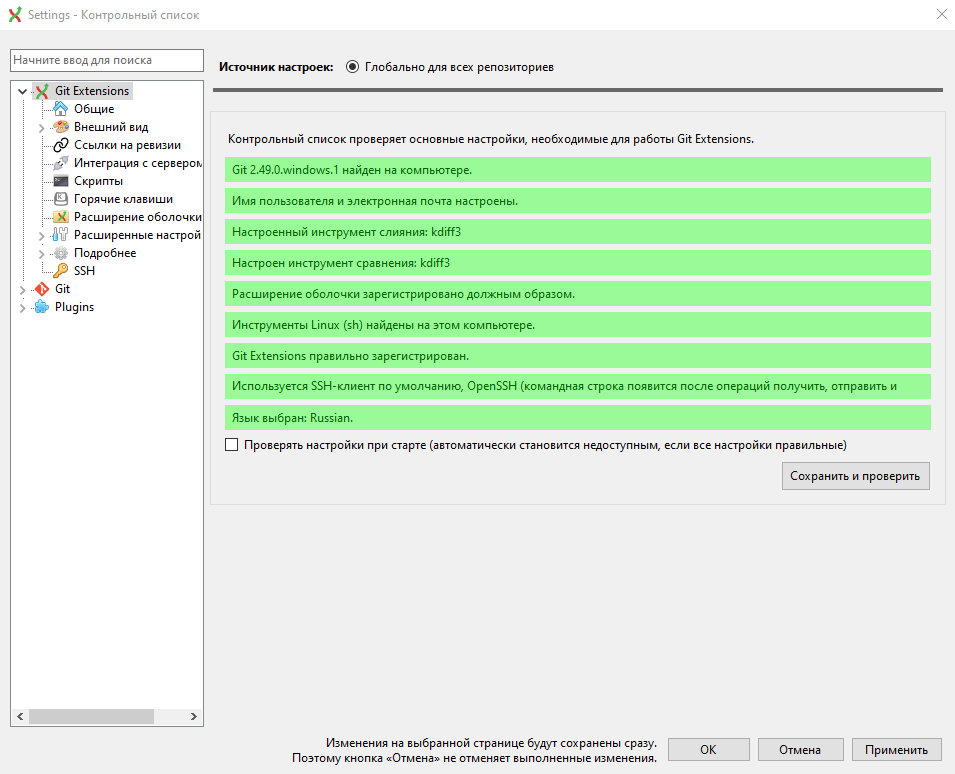
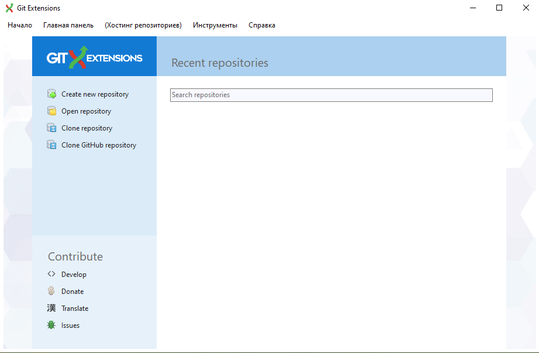

## Для чего

Так как работа над проектом ведется в команде, необходим общий доступ к репозиторию, а так же осуществление контроля версий.

Безоговорочным лидером для решения этой задачи является **Git**. Мы же используем приложение от разработчиков Git, в котором собран весь её функционал, обернутый в пользовательский UI, чтобы визуализировать процесс и упростить понимание происходящего.

## Установка

Скачать его можно из официального репозитория:

:::tip 

<https://github.com/gitextensions/gitextensions/releases/tag/v5.2.1>

:::

1. Для установки внизу страницы выбрать файл [GitExtensions](https://GitExtensions-x64-5.2.1.18061-0d74cfdc3.msi)

   {width=1231px height=200px}

2. Открыть загрузившийся исполняемый файл

3. Пройти по этапам мастера установки

## Настройка

После запуска программы и выбора языка откроется окно следующего вида

{width=955px height=774px}

:::note 

Здесь важно сделать так, чтобы все пункты были **зелеными**

:::

Подробнее о пунктах:

-  Git найден - должна стать зеленой сразу

-  Имя пользователя и электронная почта - нужно ввести данные

-  Инструмент слияния - [KDiff3](./kdiff3)

-  Инструмент сравнения - [KDiff3](./kdiff3)

-  Язык - выбрать нужный

-  Остальные пункты должны заполниться автоматически

После успешной настройки нажать *ок* и откроется основное окно программы

{width=922px height=603px}